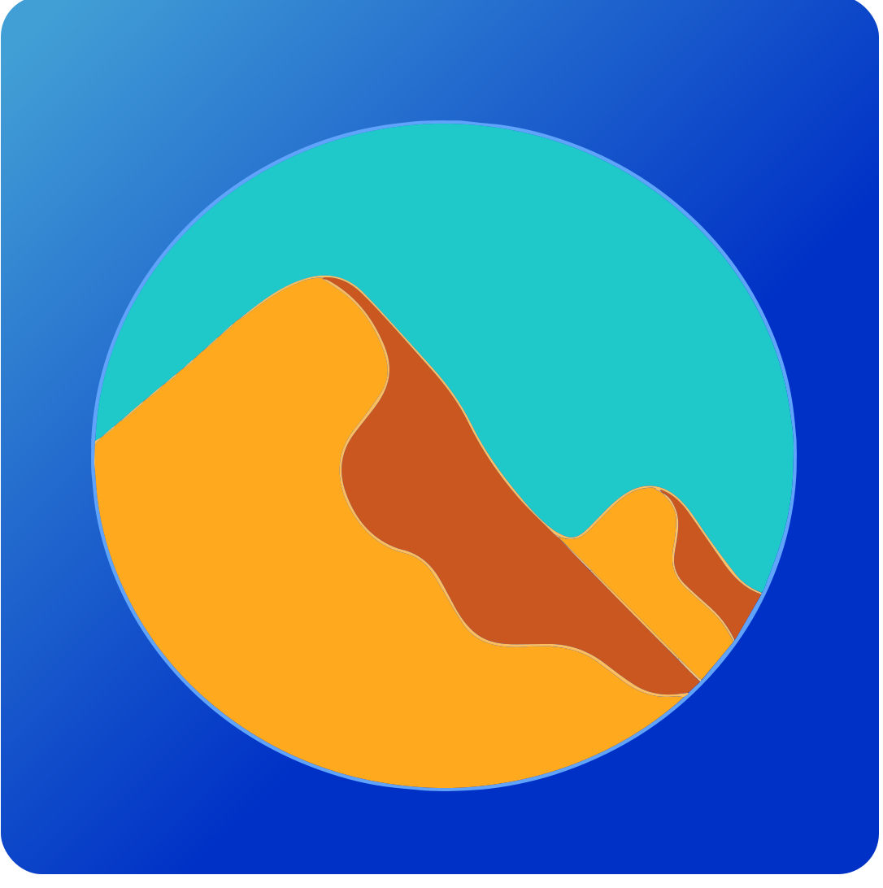

# Temporis

> A pomodoro timer focused on attention and well-being.

_[temporis-logo](https://github.com/reciperium/temporis/blob/main/ui/icons/logo.svg) © 2025 by [Lara Sitruk](https://www.instagram.com/lazomicreative/) is licensed under [CC BY 4.0](https://creativecommons.org/licenses/by/4.0/)_

## Installation

```sh
nix profile install github:reciperium/temporis
```

## Why?

A pomodoro application can help you switch between focus mode, where you can explore a single idea in depth, and diffusion mode,
where you can let your mind wonder around, and subconsciously explore other ideas, avoiding the [Einstellung effect](https://en.wikipedia.org/wiki/Einstellung_effect).
Furthermore, clear breaks give you space to stretch, move and hydrate.

The app tries to consolidate nice features from different pomodoro apps, into a single one, with the style of
the host operating system.

Reciperium builds applications for the mind and soul.

## Platforms

- Linux
  - [x] Nix
  - [ ] AppImage
- MacOS
  - [x] Nix
  - [ ] DMG

## Features

- Switch between focus work and diffusion modes
- Shortcuts
- App style based on OS
- Notifications reminding you to stretch and hydrate
- Configuration
- Visible progress
- WIP: Sound notification
- WIP: Automatically set "Do not disturb" mode during focus work sessions (KDE for now using dbus)

## Shortcuts

- <kbd>S</kbd> Start / Stop (pause)
- <kbd>R</kbd> Reset
- <kbd>K</kbd> Skip
- <kbd>C</kbd> Configuration
- <kbd>B</kbd> Back

---

## Thanks

- [Vadoola](https://github.com/Vadoola) for the display time equation using slint lang, as I was completely lost. [time-remaining()](https://github.com/Vadoola/Tomotroid/blob/main/ui/appwindow.slint#L88)
- [Francis](https://github.com/KDE/francis) is a pomodoro app for KDE, built using the KDE Kirigami framework, I drew a lot of inspiration from it.


## Resources

- [freedesktop.org/desktop-entry-spec/recognized-keys](https://specifications.freedesktop.org/desktop-entry-spec/latest/recognized-keys.html)
- [KDE kirigame in rust](https://develop.kde.org/docs/getting-started/kirigami/setup-rust/#build)
- show progress in task bar: `com.canonical.Unity.LauncherEntry`
- [Urgency levels](https://specifications.freedesktop.org/notification-spec/latest/urgency-levels.html)
- [makeDesktopItem](https://nixos.org/manual/nixpkgs/stable/#trivial-builder-makeDesktopItem) for NixOS
